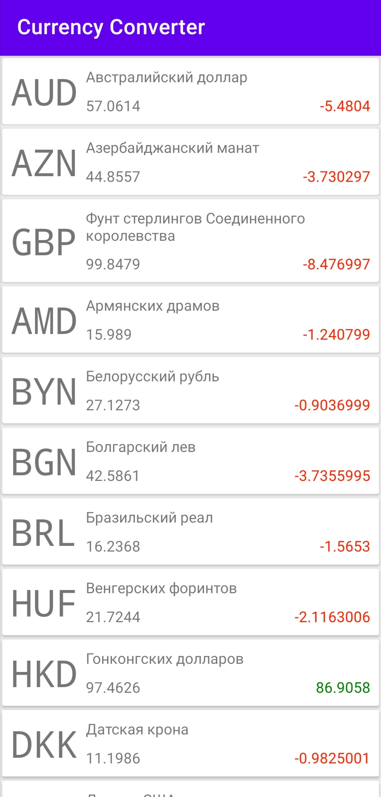
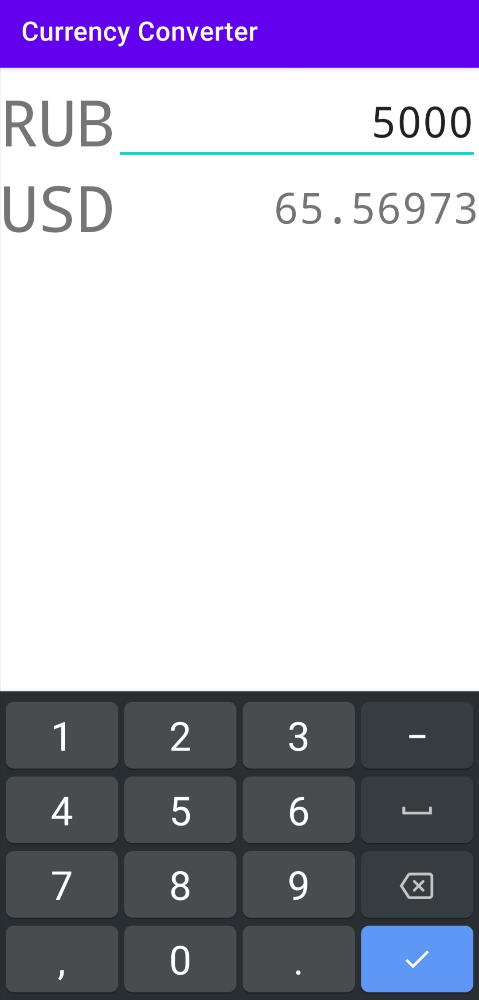

# Конвертер валют
Реализовано отображение списка валют и конвертация.
Навигация выполнена с помощью фрагментов  
Библиотеки:  
Retrofit - для получения и парсинга списка валют  
ViewModel - для хранения списка валют и его обновления  
RecyclerView - для отображения списка  
Gson + Converter-Gson - для работы с Json и его конвертации в объекты Kotlin  
SwipeRefreshLayout - для обновления списка потягиванием вниз  

